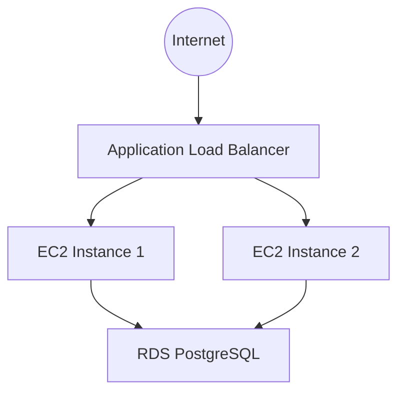

# Assignment C3: Highly Available and Fault-Tolerant Application Stack (appstack-C3)

This stack deploys the application layer on top of the existing infrastructure. It instantiates the reusable `modules/appstack` module, passing in environment-specific configurations via `terraform.tfvars`.

## Application Components

*   **Load Balancer:** An Application Load Balancer (ALB) listening on HTTP/HTTPS, forwarding traffic to the ASG.
*   **Compute:** An Auto Scaling Group (ASG) launching nginx EC2 web servers on Amazon Linux instance types.
*   **Database:** An RDS PostgreSQL instance.

## Architecture Diagram



## Input Variables

| Name | Description | Type | Default |
|------|-------------|------|---------|
| `vpc_name` | Name of the VPC | `string` | `mzcinfra-useast1-production` |
| `certificate_arn` | ARN of the SSL certificate for ALB | `string` | `-` |
| `environment` | Deployment environment | `string` | `production` |
| `name_prefix` | Prefix for resource names | `string` | `mzcinfra` |
| `ssh_keypair_name` | Name of the SSH keypair | `string` | `mzc-ssh-keypair` |
| `db_engine` | Database engine type | `string` | `postgres` |
| `db_instance_class` | RDS instance class | `string` | `db.t3.micro` |
| `db_allocated_storage` | Allocated storage in GB | `number` | `20` |
| `db_multi_az` | Enable Multi-AZ deployment | `bool` | `false` |
| `db_skip_final_snapshot` | Skip final snapshot on deletion | `bool` | `true` |
| `instance_type` | EC2 instance type | `string` | `t3.micro` |
| `min_size` | Min size of ASG | `number` | `2` |
| `max_size` | Max size of ASG | `number` | `4` |
| `desired_capacity` | Desired capacity of ASG | `number` | `2` |
| `owner` | Owner email for tagging | `string` | `-` |
| `region` | AWS region | `string` | `-` |
| `profile` | AWS profile | `string` | `-` |

## Deployment

Ensure `infra-C1` is deployed first. This stack reads VPC and Subnet information dynamically using data sources.

1. Execute the init command

    ```text
    cd ./appstack-C3
    terraform init
    ```

2. Execute plan and validate resource creation

    ```text
    terraform plan
    ```

3. Execute apply

    ```text
    terraform apply
    ```
