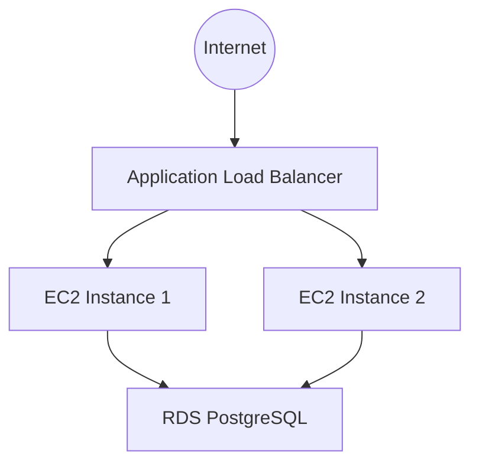

# Application Stack (appstack-C3)

This stack deploys the application layer on top of the existing infrastructure. It instantiates the reusable `modules/appstack` module, passing in environment-specific configurations via `terraform.tfvars`.

## Application Components

*   **Load Balancer:** An Application Load Balancer (ALB) listening on HTTP/HTTPS, forwarding traffic to the ASG.
*   **Compute:** An Auto Scaling Group (ASG) launching Nginx web servers on Amazon Linux 2.
*   **Database:** An RDS PostgreSQL instance.

## Architecture Diagram



## Inputs & Overrides

The following variables in `terraform.tfvars` can be used to override the default values:

### Database Configuration
*   `db_engine`: The database engine (e.g., `postgres`, `mysql`).
*   `db_instance_class`: The RDS instance type (e.g., `db.t3.micro`).
*   `db_allocated_storage`: Storage size in GB.
*   `db_multi_az`: Enable Multi-AZ for high availability.
*   `db_skip_final_snapshot`: Whether to skip the final snapshot on deletion.

### Application & General Configuration
*   `certificate_arn`: The ARN of the ACM certificate for the ALB (HTTPS).
*   `environment`: The deployment environment (e.g., `production`, `non-production`).
*   `owner`: Email address for the `Owner` tag applied to resources.
*   `ssh_keypair_name`: The name of the SSH key pair for EC2 instances.
*   `instance_type`: The EC2 instance type for the Auto Scaling Group (e.g., `t3.micro`).

### Auto Scaling Group (ASG) Configuration
*   `min_size`: Minimum number of instances in the ASG.
*   `max_size`: Maximum number of instances in the ASG.
*   `desired_capacity`: Desired number of instances to run.

### Example `terraform.tfvars`

```hcl
environment            = "production"
owner                  = "team-lead@example.com"
ssh_keypair_name       = "prod-ssh-key"
certificate_arn        = "arn:aws:acm:us-east-1:123456789012:certificate/abc-123"
db_engine              = "postgres"
db_instance_class      = "db.t3.medium"
db_allocated_storage   = 50
db_multi_az            = true
db_skip_final_snapshot = false
instance_type          = "t3.small"
min_size               = 2
max_size               = 10
desired_capacity       = 4
```

## Deployment

Ensure `infra-C1` is deployed first. This stack reads VPC and Subnet information dynamically using data sources.

## Future Enhancements

*   Validation: Utilize conditions to check for valid RDS engine names specified such as `postgres`, `mariadb`, `sql`, `oracle`, etc.
*   Add a secret rotation resource to enable automatic secret rotation every 90 days, or whatever time period is appropriate.