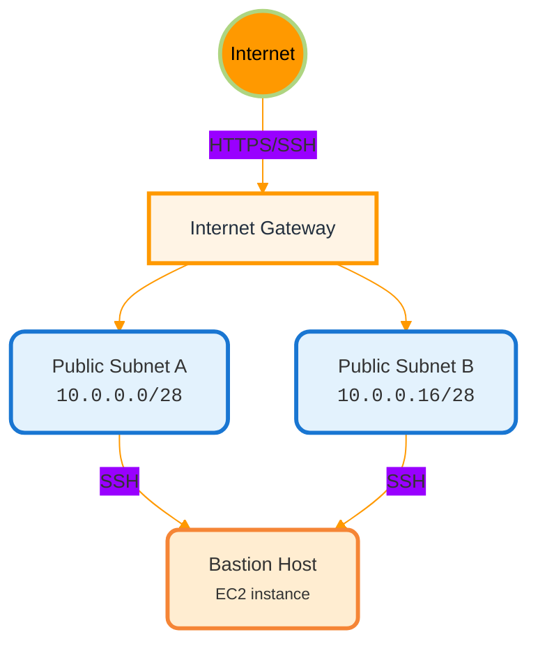

# Assignment C1: Secure and Scalable Multi-Tier VPC Foundation

This stack deploys the networking infrastructure that is the foundation for the `appstack-C3` application stack. It instantiates the reusable `modules/infra` module, passing in environment-specific configurations via `terraform.tfvars`.

## Architecture Diagram

### Public Subnets


### Private Subnets
graph TB
    AppA[App Subnet A<br/><small><code>10.0.0.32/27</code></small>]
    AppB[App Subnet B<br/><small><code>10.0.0.64/27</code></small>]
    DBA[Database Subnet A<br/><small><code>10.0.0.96/27</code></small>]
    DBB[Database Subnet B<br/><small><code>10.0.0.128/27</code></small>]
    
    NAT[NAT Gateway]
    Internet((Internet))

    AppA -->|outbound internet| NAT
    AppB -->|outbound internet| NAT
    NAT --> Internet
    AppA -->|app → db traffic| DBA
    AppA -->|app → db traffic| DBB
    AppB -->|app → db traffic| DBA
    AppB -->|app → db traffic| DBB
```

## Networking & CIDR Overview

This component utilizes a **VPC CIDR of `10.0.0.0/20`**.

Instead of hardcoding subnet ranges, I am calling the `hashicorp/subnets/cidr` module to dynamically calculate them based on the `new_bits` configuration in `main.tf`.

**Resulting Subnet Ranges:**

*   **Public Subnets (a/b):** `10.0.0.0/28` and `10.0.0.16/28` (Small range for ALBs/Bastions).
*   **Private App Subnets (a/b):** `10.0.0.32/27` and `10.0.0.64/27` (For EC2 instances).
*   **Private DB Subnets (a/b):** `10.0.0.96/27` and `10.0.0.128/27` (For RDS).

## Components

*   **VPC & Subnets:** Multi-AZ deployment provisioned in `us-east-1`.
*   **Bastion Host:** A `t3.micro` instance in the public subnet for SSH access to private resources.
*   **NAT Gateways:** Multi-AZ NAT gateway deployment provisioned for outbound internet access from private subnets.
*   **Security:** Security Groups and NACLs designed with strict, least-privilege principles.

## Input Variables

| Name                  | Description                          | Type                                      | Default                          |
|-----------------------|--------------------------------------|-------------------------------------------|----------------------------------|
| vpc_name              | Name of the VPC                      | string                                    | mzcinfra-useast1-prod            |
| vpc_cidr              | CIDR block for the VPC               | string                                    | 10.0.0.0/20                      |
| azs                   | Availability zones                   | list(string)                              | ["us-east-1a", "us-east-1b"]     |
| region                | AWS region                           | string                                    | us-east-1                        |
| profile               | AWS profile                          | string                                    | mzc-infra-prod                   |
| bastion_allowed_ip    | IP address allowed to SSH to bastion | string                                    | 74.44.134.129/32                 |
| create_bastion        | Whether to create bastion host       | bool                                      | true                             |
| bastion_instance_type | Instance type for bastion host       | string                                    | t3.micro                         |
| environment           | Deployment environment               | string                                    | production                       |
| name_prefix           | Prefix for resource names            | string                                    | mzcinfra                         |
| owner                 | Owner email for tagging              | string                                    |                                  |
| subnet_config         | Configuration for subnets            | list(object({ name = string, new_bits = number })) |                         |

## Outputs

*   `vpc_id`: The ID of the created VPC.
*   `public_subnet_ids`: List of public subnet IDs.
*   `private_app_subnet_ids`: List of private application subnet IDs.
*   `private_database_subnet_ids`: List of private database subnet IDs.
*   `bastion_public_ip`: Public IP address to SSH into the bastion.
*   `ssh_private_key`: **Sensitive.** The private key PEM for accessing the bastion.

## Deployment

1. Execute the init command

    ```text
    cd ./infra-C1
    terraform init
    ```

2. Execute plan and validate resource creation

    ```text
    terraform plan
    ```

3. Execute apply

    ```text
    terraform apply
    ```
