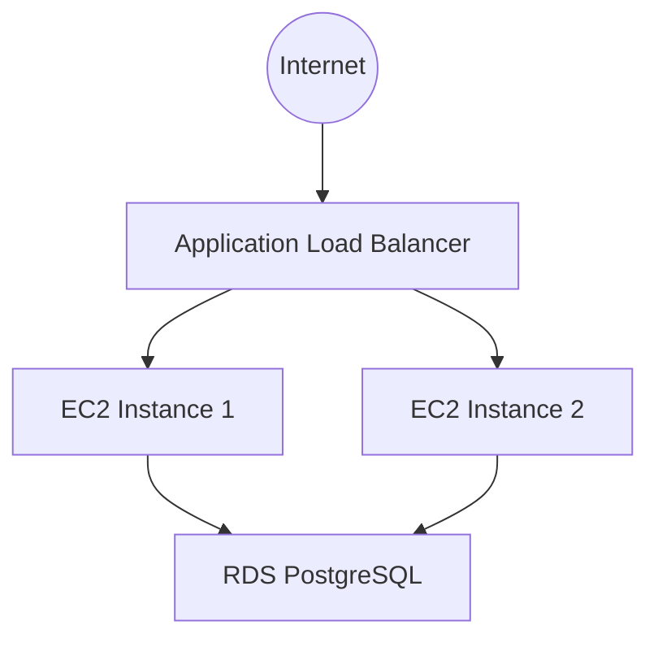

# Application Stack Module

This module deploys a flexible 3-tier web application architecture, including an Application Load Balancer, Auto Scaling Group with EC2 instances, and a configurable RDS database instance. Via `terraform.tfvars`, a user can select the database engine type and enable Multi-AZ deployment for high availability.

## Architecture Diagram

## Resources Created

*   **Application Load Balancer (ALB):** Public-facing, handles HTTP/HTTPS traffic.
*   **Auto Scaling Group (ASG):** Manages EC2 instances running the web application (Nginx).
*   **RDS Instance:** Managed database.
*   **Secure Secrets:** Secure storing of secrets. Provides the ability to rotate database credentials since it uses Secrets Manager.
*   **IAM Role / Policy:** Grants EC2 instances permission to read secrets.

## Input Variables

| Name | Description | Type | Default |
|------|-------------|------|---------|
| `certificate_arn` | ARN of the SSL certificate for ALB | `string` | `us-east-1` |
| `environment` | Deployment environment | `string` | `production` |
| `owner` | Owner email for tagging | `string` | `production` |
| `vpc_name` | Name of the VPC to deploy into | `string` | N/A |
| `name_prefix` | Prefix for resource names | `string` | `mzc` |
| `ssh_keypair_name` | Name of the SSH keypair | `string` | `mzc-ssh-keypair` |
| `db_engine` | Database engine type | `string` | `postgres` |
| `db_instance_class` | RDS instance type | `string` | `db.t3.micro` |
| `db_allocated_storage` | Storage size in GB | `number` | `20` |
| `db_multi_az` | Enable Multi-AZ | `bool` | `false` |
| `db_skip_final_snapshot` | Snapshot before destroy | `bool` | `false` |
| `instance_type` | EC2 instance type | `string` | `t3.micro` |
| `min_size` | Min size of ASG | `number` | `2` |
| `max_size` | Max size of ASG | `number` | `4` |
| `desired_capacity` | Desired capacity of ASG | `number` | `2` |
| `region` | AWS Region | `string` | `us-east-1` |
| `profile` | AWS Profile | `string` | `mzc-infra-prod` |

## Output Variables

*   `alb_dns_name`: DNS name of the ALB.
*   `rds_endpoint`: Endpoint of the RDS instance.
*   `asg_db_secret_arn`: ARN of the DB secret.
*   `db_connection_string_secret_arn`: ARN of the DB connection string secret.